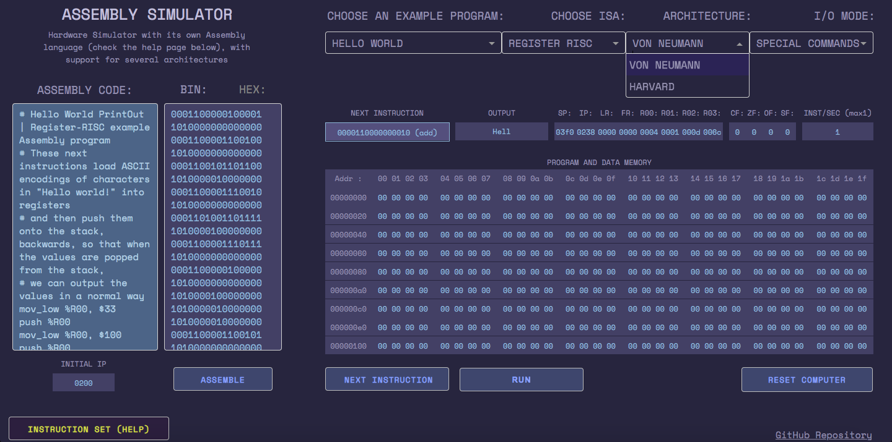

# POC Project: Hardware simulator and assembler
[Website](http://assemblysimulator.pythonanywhere.com)
---

## Description:

A Hardware Simulator and an Assembler, with several 
Instruction Set, Memory, I/O Architectures supported.



## Architectures:

* Instruction Set Architecture (Register Architecture)

  1. Stack (Zero-Address)

  2. Accumulator (One-Address)

  3. Register (Two-Address)

* Instruction Set Complexity

  1. Reduced Instruction Set Computer (RISC)
  
  2. Complex Instruction Set Computer (CISC)

* General Memory Architecture

  1. Von Neumann (Princeton) architecture

  2. Harvard architecture
  
  3. Modified Harvard architecture

* Input/Output

  1. Memory-Mapped I/O
  
  2. Separate Space MMIO
  
  3. Special commands

+ SIMD

---

## Usage for Contributing

```bash
# Testing
git clone https://github.com/dariaomelkina/poc_project
# Assembler:
python3 modules/assembler.py -f modules/program_examples/assembly_test.asm --isa RISC3
# Simulator:
python3 modules/simulator.py --file modules/program_examples/assembly_test6.bin --isa RISC3 --architecture neumann --output special
# Fork, Edit and open Pull Requests or Issues
```

---

## Prerequisites:

Admittedly, there are a lot of those, but we plan to rewrite the front-end without using Dash.

```bash
pip install -r requirements.txt
```
---

## Testing:

```bash
python3 modules/test_assembler.py
python3 modules/test_processor.py
```

---

## Credits:

---

## License:

[GNU General Public License v3.0](LICENSE)